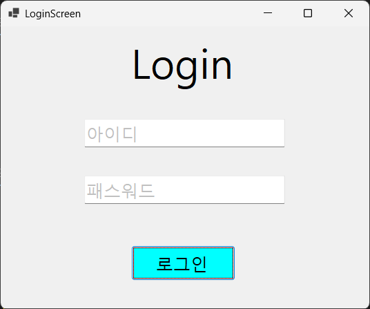
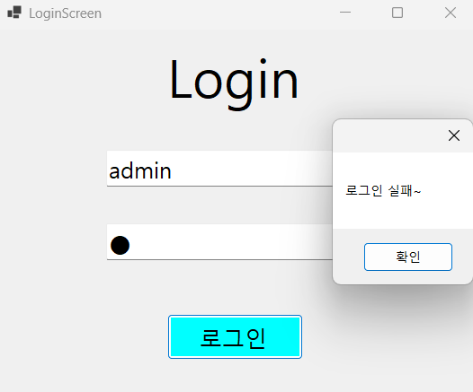
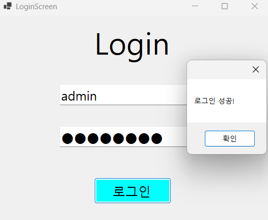
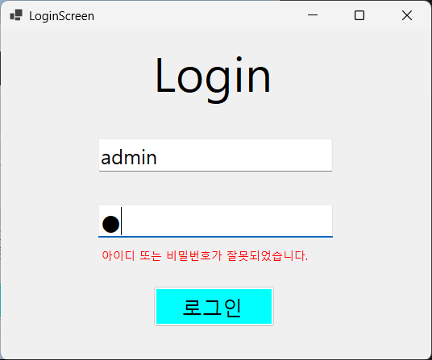
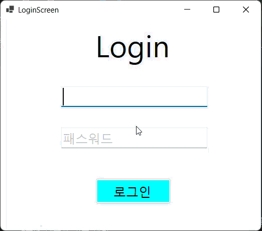

# (C# 코딩) LoginScreen

## 개요
-C# 프로그래밍학습
-핵심기능: ...
-화면구성: ...
-사용한 플랫폼: 
  -C#, .NET Windows Forms, Visual Studio, GitHub
-사용한 컨트롤:
  -Label, TextBox, Button, MessageBox
-사용한 기술과 구현한 기능:
    - Label, TextBox, Button 사용
    - Visual Studio를 이용하여 UI 디자인
    - Tab을 이용한 입력 포커스 제어
    - 패스워드 입력 내용을 숨기는 기능 구현
    - PlaceHolder 기능 구현

## 실행 화면(과제1)
-1단계 코드의 실행 스크린샷

-과제 내용
  - Label, TextBox, Button UI 배치
  - 아이디와 패스워드 값을 받아 비교
  - Text PlaceHolder 기능 구현하여 안내 문구 보이기
-구현 내용과 기능 설명
  - 아이디와 비밀번호를 입력받는 창에 안내 문구 표시
  - 입력 포커스가 입력 창에 온다면 안내 문구 제거, 포커스가 벗어났을때 값이 적혀있지 않다면 안내 문구 복구, 아니라면 제거 유지
  - 처음 실행 시 입력 포커스가 버튼으로 가도록 조정
  - 버튼 클릭 시 아이디와 비밀번호를 비교하여 맞다면 로그인 메세지 박스 출력, 틀리다면 틀린 메세지 박스 출력
  - 비밀번호 입력은 보이지 않게 변경

## 실행 화면(과제2)
-2단계 코드의 실행 스크린샷

-과제 내용
  - 아이디 혹은 비밀번호가 틀렸을 시 메세지 박스를 사용하지 않고 오류 출력
  - Enter키를 사용하여 비밀번호 입력창 포커스, 로그인 버튼 클릭
-구현 내용과 기능 설명
  - 비밀번호 입력창 아래에 오류 메세지를 보여주는 라벨 추가, 만약 비밀번호가 틀리다면 라벨 활성화, 맞다면 비활성화
  - ID와 PW에 KeyDown을 추가하여 ID에서 Enter를 받을 시 PW로 이동, PW에서 Enter를 받을 시 로그인 클릭을 하도록 설정

  
## 실행 화면(과제3)
-3단계 코드의 실행 스크린샷

-과제 내용
  - 비밀번호가 보이게 표시, 그리고 한번에 삭제
-구현 내용과 기능 설명
  - 비밀번호 입력 창에 포커스시 btnPWVisable, btnPWDel이 보이게, 포커스 취소 시 보이지 않게 설정
  - btnPWVisable을 만들어 클릭 시 비밀번호가 보이게, 다시 클릭시 보이지 않게 설정
  - btnPWDel을 만들어 클릭 시 비밀번호를 전부 삭제하고 초기화